# CBN

## Projekt


## Point of View
> Wie können wir den Studenten helfen, Kontakt zu anderen Fakultäten aufzubauen.

___
## 1. Material und Werkzeug
### Material für Netzwerkverbindung
* LAN-Kabel
* Switch
* (Alternativ Wi-Fi auf Raspberry-Pi für Netzwerkaufbau)

### Material für jeweils ein Spielgerät
* 1x Raspberry-Pi
* 1x Arduino-Mega
* 1x LCD
* 1x LED-Matrix
* 1x Webcam
* 4x Buttons für Steuerung
* 1x Button für Spielbereit/Spielstarten
* 1x Adapter für die Stromversorgung der Matrix (2A/5V)
* 1x Adapter für die Stromversorgung des Raspberry-Pi
* 1x USB to FireWire (Männlich/Männlich)
* Lötzinn
* 5 Widerstände (z.B. 10k Ohm)
* mindestens 16GB große Micro-SD-Karte

### Werkzeug
* Holzberarbeitungswerkzeug für das Gehäuse:
*  - Tischkreissäge
*  - Lasercutter
*  - Bohrer
* Holz für das Gehäuse:
*  - 4m² Sperrholz (~4mm dick) je Gehäuse
*  - 4000mm * 70mm * 18mm Holzbrett je Gehäuse
*  - 1m Holzbalken je Gehäuse
*  - 600mm * 300mm * 18mm Holzbrett je Gehäuse
* Holzleim für das Gehäuse
* Lötkolben
* Schraubendreher
* Schrauben

___
## 2. Arduino-Mega (Labyrinth-Spiel)
### Anschlüsse / Verkabelung
### Matrix
Die Matrix wird wie folgt an den Arduino-Mega angeschlossen:

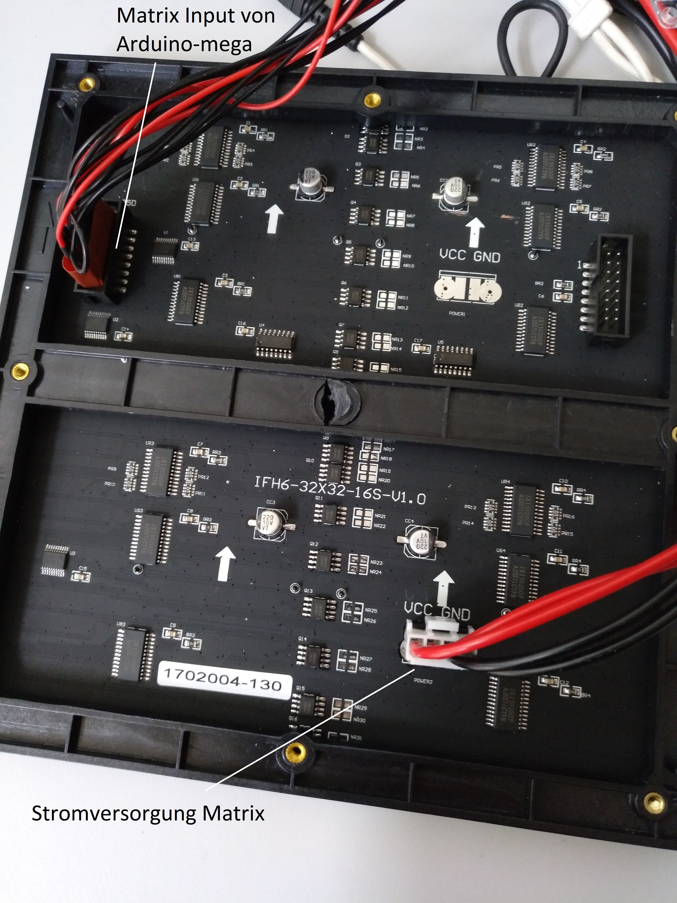
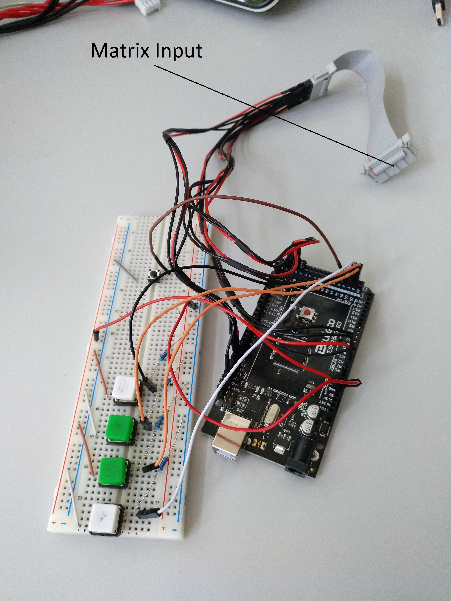

Die Detaillierte Verkabelung finden Sie auf der [Herstellerseite](https://learn.adafruit.com/32x16-32x32-rgb-led-matrix/connecting-with-jumper-wires)

### Buttons
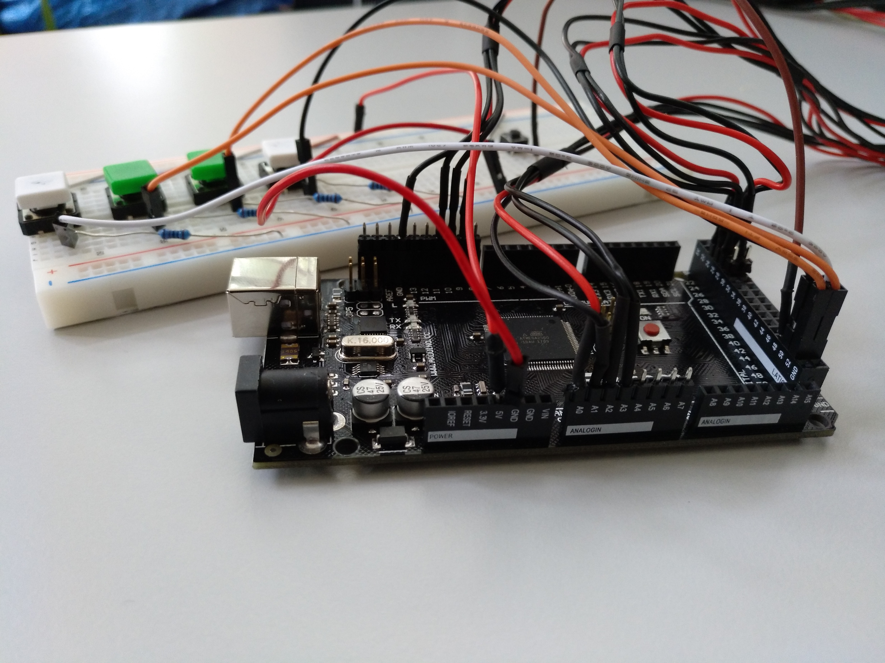

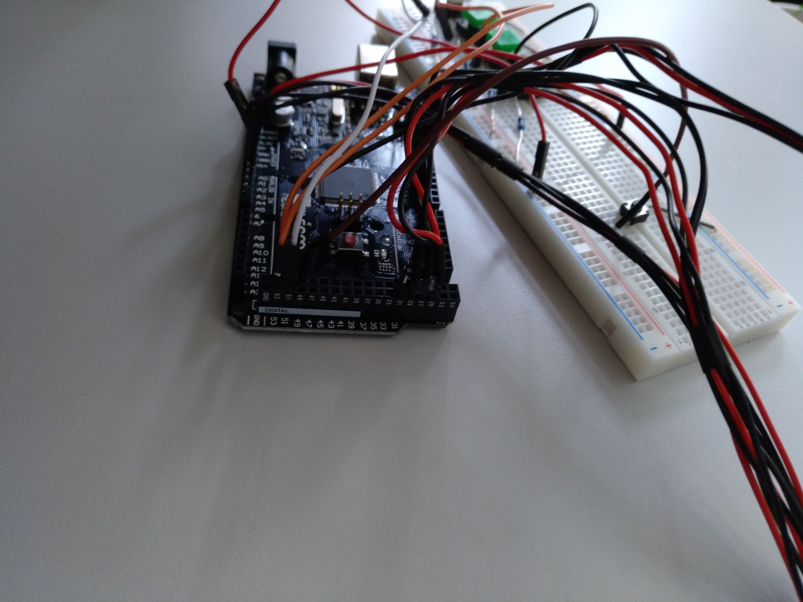

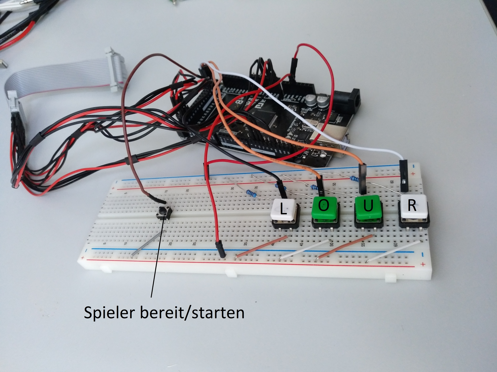


Bei der Verkabelung der Buttons ist zu beachten, dass ein Pulldown Wiederstand zwingend erforderlich ist (siehe Abbildung).
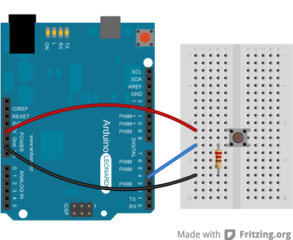


### Software

1. Die Bibliothek 
[RGB-matrix-Panel](https://drive.google.com/file/d/0B50TDmuMFSKsUUpuMk5kRlZKdFk/view?usp=sharing) und [Adafruit-GFX](https://drive.google.com/file/d/0B50TDmuMFSKsV3NNSXlYT0RGSzA/view?usp=sharing) herunterladen
1. Die [Datei](Matrix-Game/CBM-Matrix-Game.ino) mit Hilfe der Arduino-IDE öffnen
2. Nun auf den Reiter Sketch gehen dort den Unterpunkt Bibliothek einbinden wählen und hier dann .ZIP Bibliothek einbinden auswählen, dies für beide gedownloadeten Zip-Bibliotheken durchführen
3. Nun kann man durch klicken auf den Hochladen Button das Programm auf den Arduino aufspielen
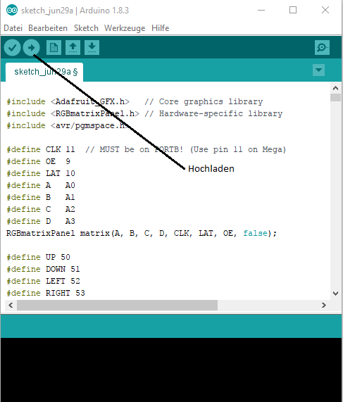

___
## 3. Raspberry-PI
Alle notwendigen Einstellungen sind im folgenden [Image](https://drive.google.com/file/d/0B50TDmuMFSKsd2daOUdSY3BQbTg/view?usp=sharing) enthalten.
Dazu einfach die SD-Karte mit diesem Image bespielen.
Hierfür diese Anleitung für [Windows](https://www.raspberrypi.org/documentation/installation/installing-images/windows.md), [Mac OS](https://www.raspberrypi.org/documentation/installation/installing-images/mac.md) und [Linux](https://www.raspberrypi.org/documentation/installation/installing-images/linux.md) benutzen.
Für diese Installation ist es wichtig, dass eine mindestens 16GB große Micro-SD-Karte benutzt wird, da sonst das Image nicht aufgespielt werden kann.

### LCD

Um das Raspberry PI mit dem Bildschirm zu verbinden verwenden Sie bitte folgende [Anleitung](https://thepihut.com/blogs/raspberry-pi-tutorials/45295044-raspberry-pi-7-touch-screen-assembly-guide)


### Konfiguration

Die Konfiguration erfolgt durch anschließen einer Maus und Tastatur an das Raspberry-PI.
1. Nach dem Start des Gerätes ```ALT+F4``` drücken, um den Browser zu schließen der das Webcambild des anderen PIs anzeigen sollte
2. ```nano /home/pi/restApi.py```
3. In der Datei die IP-Adresse des Partner PIs eintragen
4. ```CTRL+X``` drücken und die Datei speichern
5. ```sudo nano /home/pi/kiosk.sh```
6. Schritt 3. und 4. widerholen
7. Das Raspberry PI neustarten (sudo reboot)

___
## 4. Gehäuse
Das Gehäuse besteht aus 3 Komponenten:
- Der Hauptkomponente, in der die LED-Matrix, der Raspberry Pi mit Display, die Kamera, sowie der Arduino untergebracht werden.
- Dem Kontroller, in welchem die Buttons untergebracht sind.
- Dem Standbein, der die ganze Konstruktion hebt.
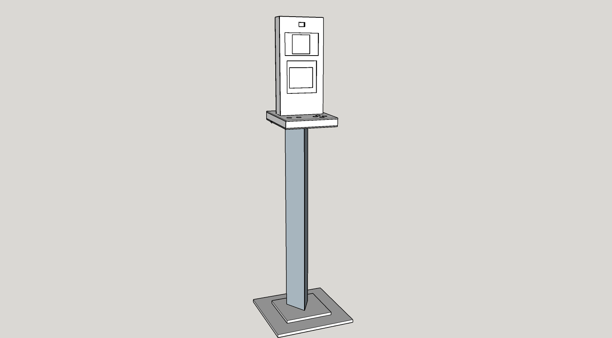

**Hauptkomponente**

Die Hauptkomponente des Gehäuses besteht jeweils aus einem Rahmen und 3 Sperrholzplatten.
Die Segmente des Rahmens sind 2x560mm und 2x 260mm lang, haben eine Breite von je 70mm und laufen an beiden Enden rechtwinklig zu.
10mm vom vorderen Rand aller Segmente entfernt, ist auf der Innenseite (schmalere Seite) eine 1cm tiefe Nut zu hinterlassen. In diese Nut wird später eine Sperrholzplatte geschoben, welche dazu dient, die LED Matrix sowie das Display in Position zu halten.

Als nächstes wird die Sperrholz-Platte zurechtgeschnitten, sodass wir zwei 560mm x 260mm und eine 540mm x 240mm große Platte haben. Die Reste der Platte werden beim Bau des Kontrollers weiterhin benötigt.
Eine der größeren Platten bleibt unverändert, wohingegen in die beiden übrigen Platten Löcher für Matrix, Display und Webcam gemacht werden müssen.

Beim montieren des Rahmens muss beachtet werden, dass die kleinere Sperrholzplatte vor dem Zusammenfügen hineingesetzt wird. Anschließend kann die Front befestigt werden. Die Rückseite wird erst nach dem Verkabeln befestigt.

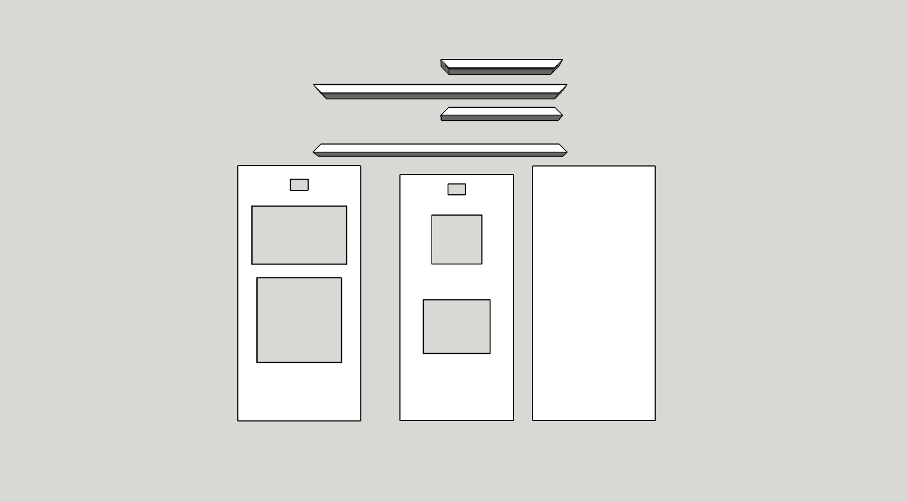

**Kontroller**

Der Kontroller besteht aus einem Rahmen, sowie 2 Sperrholzplatten.
Die Segmente des Rahmens sind 2x350mm und 2x 325mm lang, haben eine Breite von mindestens 50mm und laufen an beiden Enden rechtwinklig zu. Die Länge kann nach Bedarf variiert werden.
Als nächstes wird auch hier die Sperrholz-Platte zurechtgeschnitten, sodass wir zwei 350mm x 325mm große Platte haben.
Auch hier bleibt eine der Platten unverändert. In die andere werden Löcher für die Buttons, sowie die Hauptkomponente geschnitten.

Auch hier gilt beim Montieren, dass die Rückseite erst nach fertiger Verkabelung montiert werden sollte.

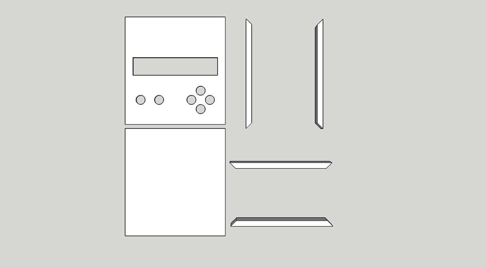

**Standbein**

Das Standbein besteht aus einem etwa einen Meter langem Balken (z.B. 70mmx70mm), sowie zwei Brettern (300mm x 400mm x 18mm| 200mm x 300mm x 18mm).
Der Balken wird auf einer Seite mit einem Winkel von etwa 15° angesägt, damit der Kontroller für den Spieler besser zu erreichen ist.
Die Beiden Bretter werden mittig aufeinandergeklebt und können nun mit Holzleim und Schrauben an der rechtwinkligen Seite des Balkens befestigt werden.
Auf der abgeschrägten Seite des Standbeins wird ein Holzbrett mit der selben Breite wie der Kontroller angebracht, an dem dieser im Nachhinein befestigt werden kann.

**Zusammenbau**

Um alle Komponenten zusammenzubauen, wird zunächst die Hauptkomponente in die dafür vorgesehene Öffnung des Kontrollers hineingeschoben, und die Buttons verkabelt. Ist dies geschehen kann die Rückseite des Kontrollers angebracht werden.
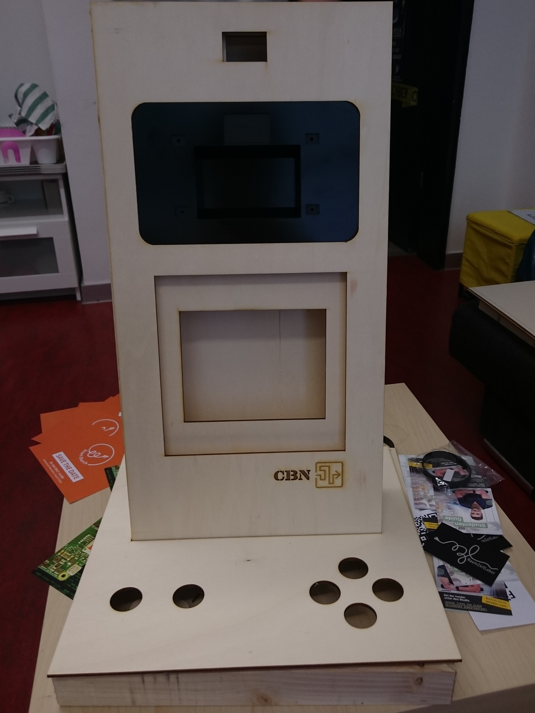

Diese gesamte Konstuktion kann nun auf das hierfür vorgesehene Brett am Ende des Standbeins geschraubt oder geklebt werden.

## Ausblick

**Raspberry:**

Essentiell ist das Beheben der Ruckler im Videostream -> Hitzeproblem des Raspberry-PI reduzieren und ggf. Framerates des Streams in der config anpassen.

**Labyrinth-Spiels:**

Erweiterungen waren Anfangs geplant und werden ggf. noch nachgeholt:
* roter Button als "Aufgeben / Spiel neustarten"
* Schwierigkeitsstufen einführen, die man bei Spielstart auswählen kann
  * Spielfeld drehen, um Kommunikation für Richtung zu erschweren
  * zeitliche Frist, um durch das Labyrinth zu kommen
  * Zeit: Ranksystem
